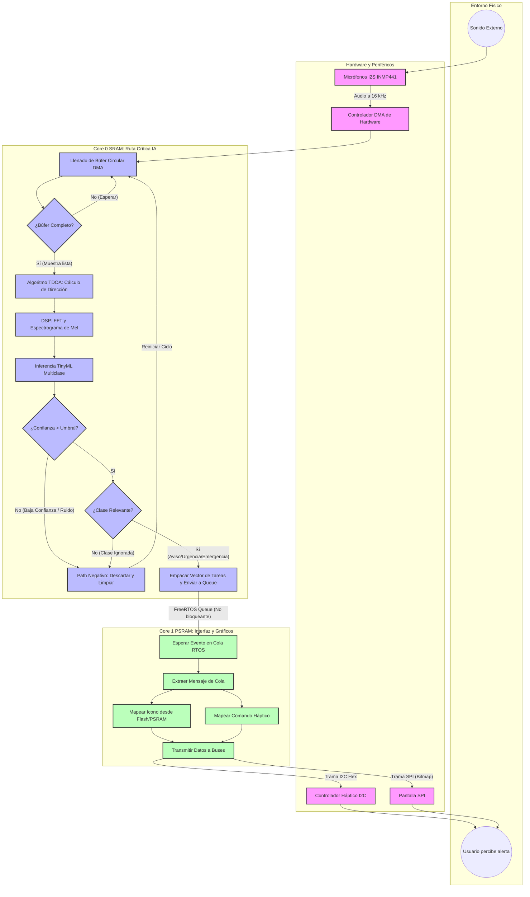

# DAIDA Dispositivo de Asistencia Inteligente para Discapacidad Auditiva

Un proyecto avanzado de sistemas embebidos y TinyML diseñado para asistir a personas con discapacidad auditiva mediante la detección, cálculo espacial y clasificación de sonidos ambientales críticos. El sistema procesa el audio en tiempo real directamente en el dispositivo (*Edge AI*) y proporciona retroalimentación multisensorial inmediata.

Este proyecto abarca el ciclo de vida completo de desarrollo bajo la metodología del **Modelo V** (estándares INCOSE y VDI 2206), desde el Procesamiento Digital de Señales (DSP) e inferencia estocástica, hasta el diseño de un PCB a medida con estrictas restricciones físicas (latencia <= 150 ms, masa <= 300 g, límite de 11 pines GPIO).

---

## ✨ Características Principales
* **Clasificación Jerárquica de Audio:** Detección de ~20 clases de sonidos ambientales divididas en tres niveles paramétricos (*Aviso, Urgencia, Emergencia*).
* **Resolución Espacial (TDOA):** Cálculo de Dirección de Llegada del sonido con una resolución de 45° (8 cuadrantes).
* **Feedback Multisensorial:** 
  * **Háptico:** Patrones de vibración segregados vía bus I2C.
  * **Visual:** Pantalla SPI con íconos dinámicos y codificación cromática perimetral virtualizada.
* **Procesamiento de Baja Latencia:** Muestreo a 16 kHz y ejecución concurrente para garantizar una respuesta End-to-End <= 150 ms.

---

## 🏗️ Arquitectura del Sistema

La arquitectura implementa un enfoque de multiprocesamiento asimétrico (Dual Core) bajo FreeRTOS, segregando de forma estricta los mapas de memoria para garantizar el determinismo temporal en la ruta crítica del modelo de Inteligencia Artificial.

## 🛠️ Stack Tecnológico y Hardware

### Hardware (Dominio Físico)
* **SoC:** Seeed Studio XIAO ESP32-S3 (Xtensa Dual-Core LX7 a 240 MHz, 8MB Flash, 8MB PSRAM).
* **Captura Acústica:** 4x Micrófonos INMP441 (Bus I2S Maestro-Esclavo).
* **Actuador Háptico:** Driver DRV2605L (Bus I2C).
* **Interfaz Visual:** Pantalla TFT/OLED (Bus SPI).

### Software (Dominio Lógico y MLOps)
* **RTOS & Framework:** FreeRTOS sobre ESP-IDF (C/C++).
* **Machine Learning:** Edge Impulse (Exportación optimizada para instrucciones vectoriales Xtensa LX7).
* **Entorno de Desarrollo:** Visual Studio Code + Docker (Contenedor inmutable para compilación cruzada).
* **Diseño EDA:** Proteus Design Suite (Ruteo de Carrier Board PCB).

---

## 📈 Estado Actual (Roadmap)
- [x] Definición de Requerimientos del Sistema (REQ-01 a REQ-08).
- [x] Diseño de Arquitectura (Hardware, Memoria y RTOS).
- [ ] Diseño Detallado y Pruebas de Integración (TDOA y DSP).
- [ ] Implementación de Firmware y Cuantización del Modelo.
- [ ] Fabricación de PCB y Validación de Usuario.
