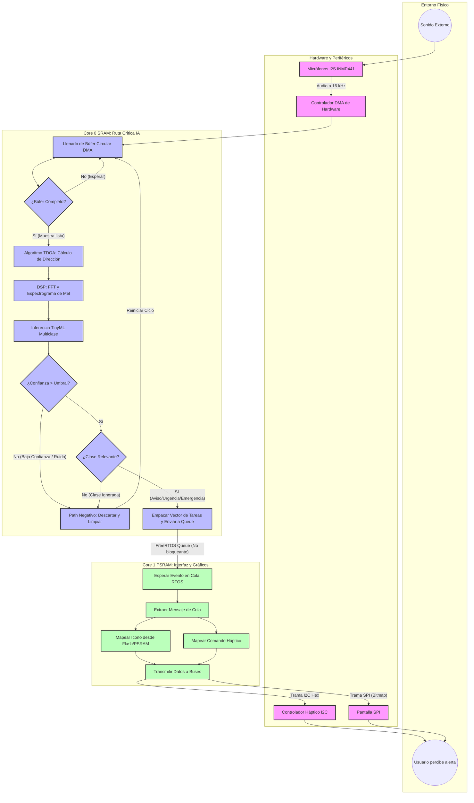

# Wearable Audio Event Detector for Hearing Impaired Assistance

An advanced embedded systems and TinyML project designed to assist hearing-impaired individuals by detecting and classifying relevant environmental sounds. The system processes real-time audio on-edge and provides immediate tactile (vibrational) and visual (luminous) feedback. 

This project encompasses the entire product development lifecycle, from digital signal processing (DSP) and machine learning inference compilation to custom PCB design with strict form-factor constraints.

---

## 1. Project Status
This project is currently in the **Research and Architecture Definition** phase.

---

## 2. System Architecture

The architecture is divided into decoupled layers to ensure portability, adherence to hardware abstraction principles, and efficient execution of Digital Signal Processing (DSP) and Machine Learning algorithms.



### 2.1 Hardware Layer (PCB Design Constraints)
* **Form Factor:** Compact, wearable proportions utilizing low-profile SMD/SMT components.
* **Microcontroller:** Target STM32 ARM Cortex-M4 MCU (leveraging the FPU for efficient DSP execution).
* **Audio Acquisition:** High-SNR MEMS Microphone interface utilizing native I2S bus.
* **Power Management:** Battery-operated design (LiPo) with dedicated power-delivery network (PDN), ultra-low-power sleep states management, and integrated charging circuitry.
* **Actuation Drivers:** Low-side MOSFET switch configuration for a high-efficiency eccentric rotating mass (ERM) or linear resonant actuator (LRA) vibrator motor, and PWM-controlled LED notification array.

### 2.2 Firmware & Software Architecture
* **Drivers & Abstraction:** Built on top of STM32Cube HAL and raw CMSIS core registers for deterministic hardware control.
* **Concurrency:** Bare-metal scheduling optimized through hardware interrupts (ISRs) and Direct Memory Access (DMA) transfers to prevent CPU starvation during heavy audio streaming.
* **DSP Pipeline:** * Audio chunks are collected via a Ping-Pong buffer mechanism (Half-Transfer & Transfer-Complete DMA interrupts).
  * Windowing (Hann/Hamming) and Mel-Frequency Cepstral Coefficients (MFCC) generation using optimized CMSIS-DSP functions.
* **TinyML Inference Engine:** * Model architectures sourced and optimized from the STMicroelectronics Model Zoo.
  * Quantization ($INT8$) and compilation for edge-execution utilizing STM32Cube.AI to minimize Flash and RAM footprint.

---

## 3. Anticipated Technical Roadmap

**Phase 1: Research & Architectural Definition (Current)**
- [ ] Finalize selection of the specific ESP32 microcontroller and peripheral ICs.
- [ ] Define acoustic feature extraction pipelines (Sampling frequency, frame length, overlap).
- [ ] Establish baseline dataset requirements for relevant sound events (e.g., alarms, doorbells, traffic sirens).

**Phase 2: TinyML & DSP Modeling**
- [ ] Train and quantize the Audio Event Detection model using Python frameworks.
- [ ] Validate floating-point vs fixed-point implementation performance.
- [ ] Benchmark execution cycles using STM32Cube.AI tools.

**Phase 3: Hardware & Firmware Development**
- [ ] Schematic capture and PCB layout optimization for signal integrity (audio traces shield/isolation).
- [ ] Implement low-level peripheral configuration (I2S, DMA, TIM-PWM, UART for telemetry).
- [ ] Integrate CMSIS-DSP routines with the TinyML inference library.

**Phase 4: Validation & Integration**
- [ ] Unit testing execution for core DSP functions.
- [ ] Hardware-in-the-Loop (HIL) injection testing of raw audio vectors to evaluate accuracy under realistic hardware power profiles.

---

## 4. Development Tools & Stack
* **Build System:** CMake + ARM GNU Toolchain (GCC).
* **Firmware IDE:** Visual Studio Code configured with the ESP-IDF for VS Code extension.
* **Hardware Design:** Proteus Design Suite (ISIS / ARES).
* **Libraries:** Espressif MCU Packages
* **Machine Learning:** Edge Impulse framework
```
